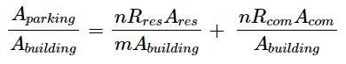

# Appendix 1: Capacity Equations

To estimate the additional housing capacity that could be added by retrofitting strip malls as residences, we consider two retrofit scenarios:

1. Sites in which all development takes the form of residential units.
2. Sites in which a certain percentage of the first floor of all development is dedicated to commercial space, and the remaining building area to residential units.

We assume all buildable area on the parcel is developed. We estimate the number of units on each parcel based on the following parameters.

* $$Aparcel$$: The total area of the parcel in square feet.
* $$Rresidential$$: The number of parking spaces required per residential dwelling unit.
* $$Rcommercial:$$ **** The number of parking spaces required per square foot of commercial space.
* $$Op:$$The fraction of the parcel’s total area required to be left open.&#x20;
* $$Cp:$$The fraction of buildings’ first floor by area that is required to be dedicated to commercial space.&#x20;
* $$F$$: The maximum allowable number of floors of any building constructed on the parcel.&#x20;
* $$Aparking:$$The area in square feet of parking area on the parcel, assuming surface parking.&#x20;
* $$Abf:$$ The area in square feet of the parcel dedicated to the building’s footprint.
* &#x20;$$Abuilding:$$ Abuilding: The total floor area of the building in square feet.&#x20;
* $$Ares:$$ The total floor area of residential spaces in the building (including corridors, etc.) in square feet.
* $$Acom:$$ The total floor area of commercial spaces in the building (including corridors, etc.) in square feet.&#x20;
* $$Adev$$: The total developed area on the parcel in square feet. This is equal to the area devoted to parking and the area devoted to the building’s footprint.&#x20;
* $$Rtot:$$ The blended parking ratio, or area of parking required per area of developed footprint on the parcel ($$Abf$$Abf).&#x20;
* Let $$m$$ represent the number of square feet required per dwelling unit and $$n$$n represent the number of square feet required per parking space.&#x20;

**The following relationships exist between these parameters:**&#x20;

&#x20;<mark style="background-color:yellow;">Equation A-1:</mark> The developed area is equal to the amount of space on the parcel not required to be open space.&#x20;

.png>)

<mark style="background-color:yellow;"></mark>

<mark style="background-color:yellow;">Equation A-2:</mark> The developed area is equal to the area devoted to parking combined with the area devoted to the building footprint. &#x20;

.png>)

<mark style="background-color:yellow;"></mark>

<mark style="background-color:yellow;">Equation A-3:</mark> The building footprint is equal to the total building floor area divided by the number of floors.  &#x20;

.png>)

<mark style="background-color:yellow;"></mark>

<mark style="background-color:yellow;">Equation A-4:</mark> The total floor area of the building is equal to the total building floor area of residences and commercial spaces. &#x20;

.png>)

<mark style="background-color:yellow;">Equation A-5:</mark> The residential floor area is equal to the number of units in the building multiplied by the required floor space per unit,$$m$$.&#x20;

.png>)

<mark style="background-color:yellow;">Equation A-6:</mark> The required parking area, based on number of units and dedicated commercial floor area, is the following: &#x20;

.png>)

Eq<mark style="background-color:yellow;">uation A-7:</mark> To express aggregate parking required per square foot of building, it is necessary to rearrange the residential parking ratio $$Rres$$ in terms of spaces per square foot of residential space rather than number of units. &#x20;

.png>)

<mark style="background-color:yellow;">Equation A-8:</mark> By dividing by the total building floor area on both sides, the equation can be written as the following: &#x20;

.png>)

<mark style="background-color:yellow;">Equation A-9:</mark> The proportion of commercial space in relation to the total floor area can be rewritten in terms of the number of floors and the fraction of the first floor dedicated to commercial space. &#x20;

<mark style="background-color:yellow;">Equation A-10:</mark> The proportion of residential space can also be rewritten in a similar way: &#x20;

.png>)

&#x20;

<mark style="background-color:yellow;">Equation A-11:</mark> By substituting these expressions into Equation 9, we find the following: &#x20;

.png>)

<mark style="background-color:yellow;">Equation 12:</mark> By expressing  $$Abuilding$$Abuilding in terms of $$Abf$$Abf, then multiplying both sides by $$F$$F, we find the blended parking ratio in Equation 14.&#x20;

.png>)

<mark style="background-color:yellow;">Equation A-13</mark>

$$AparkingAbuilding=nRres(F− Cp)mF+ nRcomCpF$$AparkingAbuilding=nRres(F− Cp)mF+ nRcomCpF&#x20;

.png>)

<mark style="background-color:yellow;">Equation A-14:</mark> It follows that the developed area can be expressed in terms of the building footprint:  &#x20;

.png>)

<mark style="background-color:yellow;">Equation A-15:</mark> Substituting in the relationships between residential area and building footprint &#x20;

.png>)

<mark style="background-color:yellow;">Equation A-16</mark>&#x20;

.png>)

<mark style="background-color:yellow;">Equation A-17</mark>&#x20;

.png>)

<mark style="background-color:yellow;">Equation A-18</mark>&#x20;

.png>)

&#x20;<mark style="background-color:yellow;">Equation A-19:</mark> We can then express the developed area in terms of the number of units.&#x20;

.png>)

<mark style="background-color:yellow;">Equation A-20:</mark> And solve for the number of units. &#x20;

.png>)

<mark style="background-color:yellow;">Equation A-21:</mark> To calculate the number of units that can be built on a developed area with no commercial space, set $$Cp$$Cp to zero.&#x20;

.png>)

