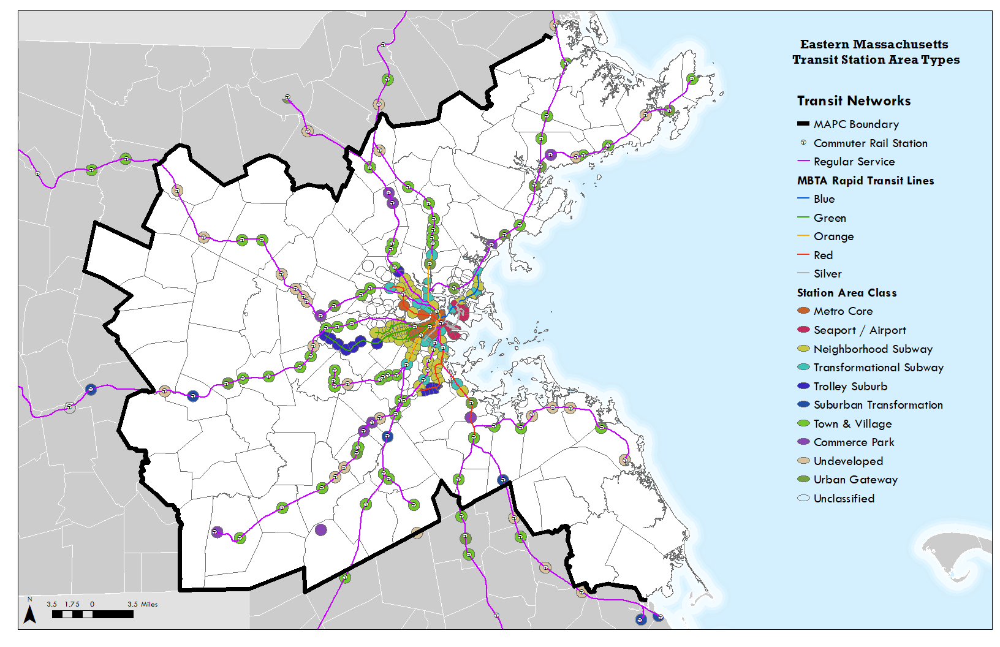
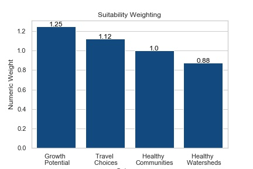

# Methods

### Data

* [Massachusetts Land Parcel Database](https://datacommon.mapc.org/browser/Land%20Use/Land%20Parcel%20Database), Metropolitan Area Planning Council (MAPC)
* [National Flood Hazard Layer](https://www.mass.gov/info-details/massgis-data-fema-national-flood-hazard-layer), Federal Emergency Management Agency (FEMA)
* [MassDEP Wetlands](https://www.mass.gov/info-details/massgis-data-massdep-wetlands-2005), Massachusetts Department of Environmental Protection (MassDEP)
* [Massachusetts Community Subtypes](http://data-metroboston.opendata.arcgis.com/datasets/b2c7ffea82a64081863bca306b5db817\_0), MAPC
* [Massachusetts Transit Station Area Typologies](http://www.mapc.org/wp-content/uploads/2020/02/MAPC-TOD-Report-FINAL-web-reduced-size.pdf), MAPC

### “Strip Mall” Candidate Parcel Identification

The candidate parcels for residential conversion are defined as retail parcels in the Metropolitan Area Planning Council region. We identified these parcels from the Massachusetts Land Parcel Database (MAPC, 2015) based on the minimum standard use code assigned to that parcel. We selected parcels with standard use codes beginning with the digits “32” for Retail Trade ([Massachusetts Department of Revenue](https://www.mass.gov/doc/property-type-classification-codes-non-arms-length-codes-and-sales-report-spreadsheet/download)). Standard use codes are three digits long.

Some retail parcels were excluded based on area or more refined land use criteria. First, we excluded parcels whose area is less than half of an acre if that parcel was not adjacent to other retail parcel(s) such that the total combined area of the cluster of adjacent retail parcels was greater than half of one acre, or 21,780 square feet. We also excluded parcels whose area is more than 50% permanently protected open space (MassGIS and EOEEA, 2020) and parcels that make up the following well-known and/or large malls in the region (>800,000 SF of retail space):

1. Burlington Mall.  (5 parcels: 0-5 Burlington Mall)
2. Northshore Mall, Peabody
3. Natick Mall
4. Patriot Place, Foxborough
5. Legacy Place, Dedham
6. Liberty Tree Mall, Danvers
7. Solomon Pond Mall, Marlborough
8. Southshore Plaza, Braintree
9. Square One Mall, Saugus
10. Cambridgeside, Cambridge
11. Assembly Row, Somerville&#x20;
12. Copley Place, Boston
13. Prudential Center, Boston

Because even within the set of land use codes we used to identify candidate parcels actual retail forms can vary widely, we removed sixteen other sites from the analysis because they are known to be not suitable candidates for conversion to residential mixed use. Identifying all candidate parcels that are already mixed use or otherwise unsuitable for conversion to residential mixed use is not within our resources, however we anticipate we will collect public feedback on sites’ suitability and adjust the results accordingly.

### Capacity Analysis

To compare the most suitable retail parcels for residential conversion, we estimated the number of housing units that could reasonably be constructed on each eligible retail parcel. The number of housing units that could be constructed on each parcel were determined based on the following parameters:

* Minimum floor area per dwelling unit
* Maximum number of floors
* Parking spaces required per dwelling unit
* Parking spaces required per 1000 square feet of commercial space
* Fraction of the building(s)’ first-floor area that would be devoted to commercial space
* Fraction of site area that must be devoted to open space
* Fraction of site area that must be setbacks from site boundaries

The parameters vary based on site location characteristics; specifically, characteristics of the community or transit service area in which the parcel is located. Our assumptions for these parameters are detailed below.

The equation approximating the number of housing units that can be constructed on a parcel given the aforementioned parameters is developed in Appendix 1 and is specified below (Equation 2) given the developed area on the parcel not devoted to open space (), the number of floors of the building , the fraction of the building’s first floor devoted to commercial space , the space required per dwelling unit in square feet, , and the blended parking ratio .The blended parking ratio is calculated based on the aforementioned factors as well as the space required per parking space in square feet (), the number of parking spaces required per residential dwelling unit , and the number of parking spaces required per square foot of commercial floor area , outlined below (Equation 1).

.png>)

.png>)

\
The number of parking spaces required per housing unit on the parcel is determined based on the number of jobs within 45 minutes by transit (Owen and Murphy, 2020) and the findings of MAPC’s Perfect Fit Parking research report (MAPC, 2019). In areas with less than 500 jobs within 45 minutes by transit, 1.5 spaces are required per dwelling unit. In areas with 501 – 50,000 jobs within 45 minutes by transit, 1 space is required per dwelling unit. In areas with 50,001 – 99,999 jobs within 45 minutes by transit, 0.75 spaces are required per dwelling unit. Lastly, 0.5 spaces are required per dwelling unit in areas with 100,000 or more jobs within 45 minutes by transit. We required three parking spaces for every 1,000 square feet of commercial space in the case of mixed-use redevelopment. We assumed all parking spaces consumed 400 square feet of parcel area, including both the space itself and area needed for car navigation through the parking lot.

The floor area of the average dwelling unit, maximum number of floors, open space requirement, and fraction of the first floor dedicated to commercial space are calculated based on the parcel’s community subtype (MAPC, 2008; Figure 1) or transit station class (MAPC, 2012; Figure 2). If the parcel is within half a mile of a transit station, the parcel’s housing capacity is estimated based on parameters dictated by its transit station class (Table 3).

Table 1: Housing capacity parameters for parcels located within half a mile of a transit station.

| Transit Station Class   | Square Feet per Dwelling Unit | Fraction of parcel that must be open space | Fraction of parcel that must be setbacks | Maximum Number of Floors | Fraction of first floor that is commercial   |
| ----------------------- | ----------------------------- | ------------------------------------------ | ---------------------------------------- | ------------------------ | -------------------------------------------- |
| Metro Core              | 1000                          | 0.1                                        | 0.1                                      | 16                       | 0.75                                         |
| Seaport/Airport         | 1100                          | 0.1                                        | 0.1                                      | 22                       | 0.75                                         |
| Neighborhood Subway     | 1000                          | 0.1                                        | 0.1                                      | 6                        | 0.5                                          |
| Transformational Subway | 1100                          | 0.1                                        | 0.1                                      | 12                       | 0.5                                          |
| Urban Gateway           | 1000                          | 0.1                                        | 0.1                                      | 10                       | 0.5                                          |
| Town & Village          | 1200                          | 0.1                                        | 0.1                                      | 5                        | 0.75                                         |
| Commerce Park           | 1100                          | 0.1                                        | 0.1                                      | 6                        | 0.5                                          |
| Suburban Transformation | 1000                          | 0.1                                        | 0.1                                      | 6                        | 0.5                                          |
| Trolley Suburb          | 1200                          | 0.2                                        | 0.1                                      | 6                        | 0.75                                         |
| Undeveloped             | 1300                          | 0.15                                       | 0.1                                      | 4                        | 0.5                                          |

If the parcel is not within half a mile of a transit station, the parcel’s housing capacity is estimated based on parameters that are dictated by its community subtype (MAPC, 2008). These parameters differ depending on whether the parcel is within 50 feet of a highway (henceforth, “adjacent to a highway”) (Table 2) or located on surface streets (Table 3).

Table 2: Housing capacity parameters for parcels located on highways outside of transit station service areas.

| Community Subtype                | Square Feet per Dwelling Unit | Fraction of parcel that must be open space | Fraction of parcel devoted to setbacks | Maximum number of floors | Fraction of first floor that is commercial |
| -------------------------------- | ----------------------------- | ------------------------------------------ | -------------------------------------- | ------------------------ | ------------------------------------------ |
| Metro Core Community             | 1000                          | 0.1                                        | 0.2                                    | 6                        | 0.5                                        |
| Sub-Regional Urban Center        | 1000                          | 0.1                                        | 0.2                                    | 6                        | 0.5                                        |
| Streetcar Suburb                 | 1100                          | 0.1                                        | 0.2                                    | 6                        | 0.5                                        |
| Mature Suburb                    | 1200                          | 0.1                                        | 0.2                                    | 6                        | 0.5                                        |
| Established Suburb/Cape Cod Town | 1300                          | 0.1                                        | 0.2                                    | 4                        | 0.5                                        |
| Maturing New England Town        | 1300                          | 0.2                                        | 0.2                                    | 6                        | 0.5                                        |
| Country Suburb                   | 1300                          | 0.2                                        | 0.2                                    | 4                        | 0.5                                        |

Table 3: Housing capacity parameters for parcels located on surface streets outside of transit station service areas.

| Community Subtype                | Square Feet per Dwelling Unit | Fraction of parcel that must be open space | Fraction of parcel area that must be setbacks | Maximum number of floors | Fraction of first floor that is commercial |
| -------------------------------- | ----------------------------- | ------------------------------------------ | --------------------------------------------- | ------------------------ | ------------------------------------------ |
| Metro Core Community             | 1000                          | 0.1                                        | 0.15                                          | 4                        | 0.5                                        |
| Sub-Regional Urban Center        | 1000                          | 0.1                                        | 0.15                                          | 6                        | 0.5                                        |
| Streetcar Suburb                 | 1100                          | 0.1                                        | 0.15                                          | 4                        | 0.5                                        |
| Mature Suburb                    | 1200                          | 0.1                                        | 0.15                                          | 4                        | 0.5                                        |
| Established Suburb/Cape Cod Town | 1300                          | 0.2                                        | 0.15                                          | 3                        | 0.5                                        |
| Maturing New England Town        | 1300                          | 0.2                                        | 0.15                                          | 3                        | 0.5                                        |
| Country Suburb                   | 1300                          | 0.2                                        | 0.15                                          | 3                        | 0.5                                        |

Capacity at each potential retail-to-residential conversion site was estimated using parameters from Tables 1-3 and Equation 2. Open space requirements at each parcel/site located adjacent to a main arterial were taken from Table 2 even if that parcel/site was also located in a transit station service area.

#### Excluded Area

We excluded parcel area not considered eligible for development from the base parcel area used to estimate capacity. The following areas were not considered eligible for development:

* Areas currently within a 1% Special Flood Hazard Area (SFHA) (MassGIS and FEMA, 2017)
* Areas within 50 feet of a MassDEP Wetland (MassGIS and MassDEP, 2005)
* Areas with slopes 20% grade or more
* Permanently protected open space (MassGIS and EOEEA, 2020)

Areas within a 1% SFHA have a more than 1% chance of flooding from high rivers or coastal surge annually. Federally-backed mortgages on properties in the 1% SFHA require flood insurance. While it is possible that future map revisions will change the extent of SFHAs, we exclude SFHAs from developable parcel area because SFHAs are strong indicators that the area is exposed to overland flow.

Wetlands are important biologically productive ecosystems. In addition to wetlands’ role as reservoirs of biodiversity, wetlands have an important role in storing excess water during storms. Land that has been converted from wetlands to other uses is often at elevated risk of flooding. We exclude wetlands and a 50-foot buffer around wetland boundaries to further protect wetland habitat and prevent flooding.

We exclude areas with slopes of 20% grade or more because construction on steep slopes is challenging and expensive.

“Permanently Protected Open Space” is “[Legally protected in perpetuity and recorded as such in a deed or other official document](https://www.mass.gov/info-details/massgis-data-protected-and-recreational-openspace).” According to MassGIS’ Open Space Data Model, examples of permanently protected open space may include property with a municipal conservation restriction in perpetuity, land owned by state conservation agencies that is covered by Article 97, or land owned by a non-profit land trust (MassGIS and EOEEA, 2020). We exclude space classified as permanently protected open space from areas considered for redevelopment.

### Retail-to-Residential Suitability Assessment

We assess retail parcels’ suitability for conversion to residential or mixed-use residential development according to several overarching criteria: “Travel Choices” available, “Healthy Communities”, “Healthy Watersheds”, and “Growth Potential” at that site. We weighted these overarching categories as shown in the figure below (Figure 3). Further detail on the indicators that contribute to each category’s score and how the indicators are weighted follows.

First, we score parcels in terms of the degree of travel choices available at that site. New housing is most beneficial in areas with more jobs within commuting distance and with more non-auto commuters already. We measured the number of jobs within 45 minutes via transit, the number of jobs within 45 minutes via auto commute at 8 AM (Owen and Murphy, 2020), the percent of non-auto commuters within the same census tract (Table 4), and location within a half mile of a train station, subway stop, or bus stop. These criteria prioritize residential developments in areas suitable for workers, especially those who commute by transit and take cars off the Boston region’s congested roads.

Table 4: Travel Choices Indicators

| Indicator                                                                                      | Spatial Operation | Source                              | Weight | Normalization strategy: 1 = best, 0 = worst.                                                                                   |
| ---------------------------------------------------------------------------------------------- | ----------------- | ----------------------------------- | ------ | ------------------------------------------------------------------------------------------------------------------------------ |
| Number of jobs within 45 minutes by transit. More is better.                                   | Spatial Join      | Minnesota Accessibility Observatory | 1.25   | Normalize by taking the natural logarithm of all values in MAPC, then distance between maximum and minimum log-values in MAPC. |
| Number of jobs within 45 minutes by auto, 8 AM. More is better.                                | Spatial Join      | Minnesota Accessibility Observatory | 0.875  | Normalize by distance between maximum and minimum in MAPC.                                                                     |
| Percentage of commuters in the census tract who use public transit to commute. More is better. | Spatial Join      | ACS                                 | 0.5    | Normalized by taking the distance between maximum and minimum values in MAPC.                                                  |
| Site's location within half a mile of a train or subway station                                | Spatial Join      | TOD                                 | 1.25   | Assigned “1” if within area, “0” if not.                                                                                       |
| Site's location within half a mile of a bus stop                                               | Spatial Join      | TOD                                 | 1      | Assigned “1” if within area, “0” if not.                                                                                       |

The second dimension for residential suitability is “Healthy Watersheds.” Here we score parcels based on their degree of overlap with 1% SFHAs and 0.2% flood zones, degree of overlap with Zone 2 Wellhead Protection Areas, and MassDEP wetlands bounded by a 100-ft buffer (Table 5). Areas with greater degree of overlap with each of these areas are scored worse to avoid flood risks, aquifer contamination, and habitat loss.

Table 5: Healthy Watersheds Indicators

<table><thead><tr><th>Indicator</th><th>Spatial Operation</th><th>Source</th><th data-type="number">Weight</th><th>Formula: 1 = best, 0 = worst</th></tr></thead><tbody><tr><td>Percent overlap with 1% flood areas (more is worse)</td><td>Calculate percent overlap</td><td>FEMA</td><td>1</td><td>1 – fraction overlapping</td></tr><tr><td>Percent overlap with 0.2% flood areas (more is worse)</td><td>Calculate percent overlap</td><td>FEMA</td><td>1</td><td>1 – fraction overlapping</td></tr><tr><td>Percent Overlap with Z2WPA (more is worse)</td><td>Calculate percent overlap</td><td>MassDEP</td><td>1</td><td>1 – fraction overlapping</td></tr><tr><td>Percent overlap with MassDEP wetland 100-ft buffer (more is worse)</td><td>Calculate percent overlap</td><td>MassDEP</td><td>1</td><td>1 – fraction overlapping</td></tr></tbody></table>

Our third scoring dimension is the growth potential available at the site (Table 6). This criterion assesses the potential housing capacity that could be developed on site (see previous section), the economic vibrancy of the retail business(es) currently on site, and infrastructural barriers to residential development. Parcels with higher business vacancy rates, lower rent per square foot, and lower improvement to land value ratio are assumed to be less economically vibrant in their current land use and thus more promising candidates for residential conversion. .We assess these factors using the housing capacity estimate developed by MAPC (see methods above), improvement to land value ratio. Sites with higher estimated housing capacity are scored more suitable, as are sites with lower improvement to land value ratio.

Table 6: Growth Potential Indicators

| Indicator                                                                                     | Spatial Operation | Source                  | Weight | Formula: 1 = best, 0 = worst.                                                               |
| --------------------------------------------------------------------------------------------- | ----------------- | ----------------------- | ------ | ------------------------------------------------------------------------------------------- |
| Number of housing units that could be constructed in a mixed-use development (more is better) | MAPC analysis     | MAPC analysis           | 1.125  | Normalized as the number of sites with lower capacity divided by the total number of sites. |
| Improvement to land value ratio (less is better)                                              | Parcel attribute  | MA Land Parcel Database | 0.5    | Normalized as the number of sites with lower ratios divided by the total number of sites.   |

The fourth scoring dimension, “Healthy Communities”, reflects the potential for healthy living at each site through safe recreation and active transportation opportunities as well as lack of exposure to hazardous substances and contaminated sites. Sites are assigned higher “Healthy Communities” scores when Walk Score (TM) is high at the site, there is a large number of public school grades within walking distance, and the site has no or minimal overlap with an Activity Use Limitatino (AUL) site and/or Chapter 21E Hazardous Materials site (Table 7).

Table 7: Healthy Communities Indicators

| Description                                                               | Spatial Operation         | Source        | Weight | Formula: 1 = best, 0 = worst.                                                 |
| ------------------------------------------------------------------------- | ------------------------- | ------------- | ------ | ----------------------------------------------------------------------------- |
| Walk score at site (higher is better)                                     | Spatial join              | Walk Score ™  | 1.125  | Normalized by taking the distance between maximum and minimum values in MAPC. |
| Number of public school grades within walking distance (higher is better) | Spatial Join              | MAPC analysis | 0.5    | Normalized by taking the distance between maximum and minimum values in MAPC. |
| AUL site 150-foot buffer zone (more is worse)                             | Calculate percent overlap | MassDEP       | 0.875  | 1 – fraction overlapping                                                      |
| Chapter 21E site 150-foot buffer zone (more overlap is worse)             | Calculate percent overlap | MassDEP       | 0.875  | 1 – fraction overlapping                                                      |

The parcels’ Travel Choices, Healthy Watersheds, Healthy Communities, and Growth Potential scores are normalized to fall on a 0-1 scale, then weighted according to the values in Figure 3 and summed into an aggregate suitability score.

### Retail-to-Residential Impact Assessment

When considering new development, city and town governments and residents often wish to understand how the new development will impact a wide range of local functions such as municipal finance, environmental quality, and congestion. We provide estimates of some of this information for each candidate site. Namely, we provide (1) estimates of the municipal tax revenue generated from each site before and after conversion and (2) estimate the amount of impervious surface added or removed at the site. We then combine the estimated “old” (pre-conversion) and “new” (post-conversion) tax revenues across municipalities, MAPC subregions, and the entire MAPC region to produce estimates of the likely fiscal impact of converting all strip mall sites to residential or residential-mixed use.

#### Tax Revenue Impact

To estimate the “old” municipal tax revenue generated at each site in its current use as a strip mall, we determine the commercial property tax from a table of fiscal year 2020 tax rates by land use class and municipality from the Commonwealth of Massachusetts Department of Revenue: Division of Local Services, Data Analytics and Resources Bureau. We multiply the commercial tax rate in each municipality by the total property value listed in the tax assessor record of each site (MAPC, 2015).

Estimating the “new” municipal tax revenue generated at each site after conversion to residential use requires an estimate of the site’s value after conversion. We produce this estimate based on the value of parcels that already resemble the parcel’s post-conversion characteristics and that are located in areas with a similar housing market to the site’s neighborhood. Specifically, we find the set of new-construction (built between 2010 and 2020) multifamily or mixed-use parcels in the same housing submarket ([MAPC](https://housing-submarkets.mapc.org), 2020) as the site. These housing submarkets, derived from MAPC’s [Housing Submarkets](https://housing-submarkets.mapc.org) research are each composed of a set of 2010 Census tracts which share similar housing stock and market characteristics.

We calculate the value per residential square foot at each parcel as the total value of the parcel divided by the residential area or, if one is not listed, by the total building area listed in the tax assessor records. We then take the average of estimated total value per residential square foot across all new-construction multifamily or mixed-use parcels in each housing submarket. Because we intend the analysis to reflect conversion to standard rather than luxury residences, we removed existing multifamily or mixed-use parcels from the set used to obtain the estimate with exceptionally high value per square foot; specifically parcels valued at more than $3,000/residential square foot. This method produced the following estimated values per residential square foot by housing submarket:

* Housing Submarket 1 (High-density urban, high prices): $764
* Housing Submarket 2 (High-density urban, lower prices): $233
* Housing Submarket 3 (Moderate-density urban, moderate prices): $311
* Housing Submarket 4 (Low-density urban/suburban mix, lower prices): $231
* Housing Submarket 5 (Low-density suburban, highest prices): $282
* Housing Submarket 6 (Low-density suburban, mixed prices): $195
* Housing Submarket 7 (Low-density suburban, moderate prices): $211

At each strip mall site, we estimate the post-conversion total taxable value as the modeled building area in square feet multiplied by the appropriate housing submarket’s estimated value per residential square foot for new multifamily and residential mixed-use parcels. We then multiply this estimated taxable site value by the municipal 2020 residential tax rate.
